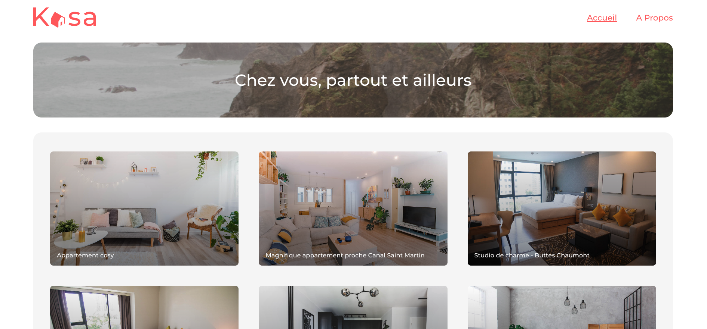
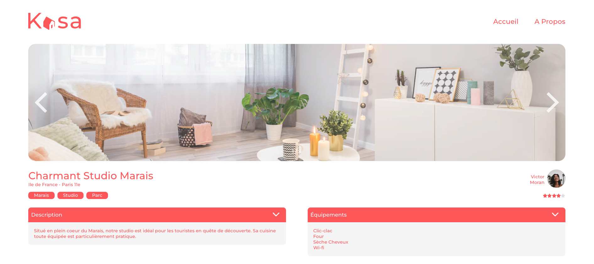

# Projet n°08 - Kasa : Application Web de Location Immobilière avec React

## Objectif du Projet

Ce projet a pour but de développer **Kasa**, une application web de location immobilière moderne et réactive, construite avec **React**.

L'objectif inclut également l'ajout d'**animations simples** pour améliorer l'expérience utilisateur, ainsi que l'implémentation d'une **galerie d'images sous forme de slider** sur les pages de détail des logements.

---

## Aperçu du Projet





---

## Technologies Utilisées

- **React (via Create React App)**
- **React Router**
- **Sass**
- **Pas de librairie React externe**

---

## Guide d'Installation et d'Utilisation

```bash
npm install
npm start
```
---

## Lien vers l'Application Déployée

Vous pouvez découvrir l'application Kasa via le lien ci-dessous :

[**https://hiro502.github.io/Openclasseroom_Project_8-kasa/**](https://hiro502.github.io/Openclasseroom_Project_8-kasa/)
